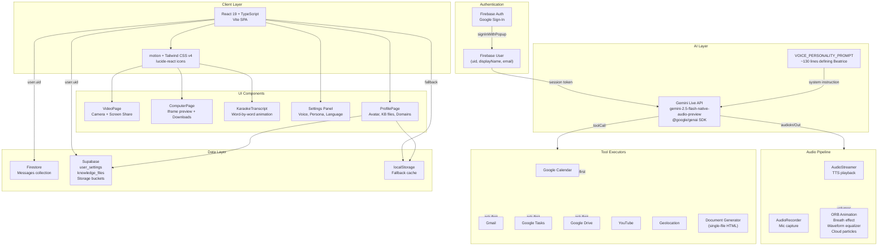
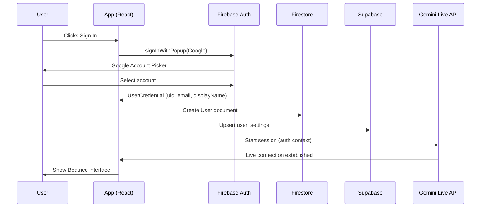
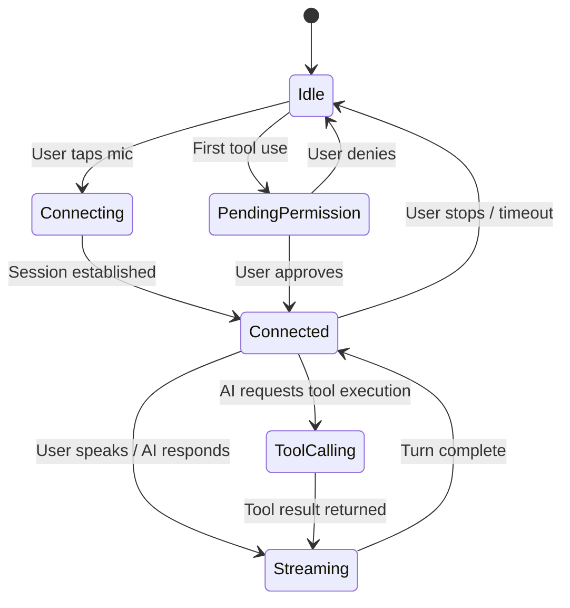
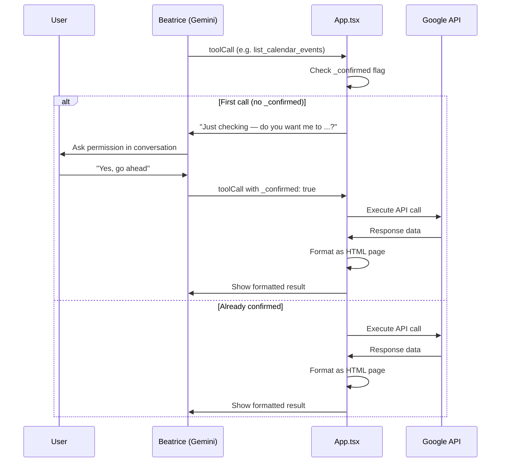
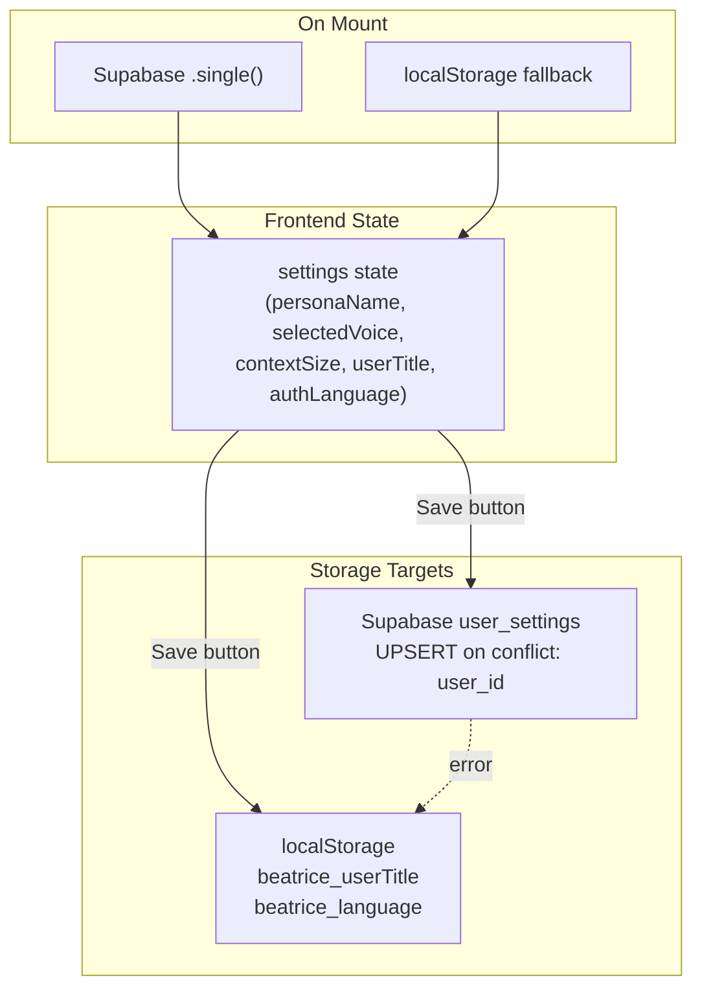

# Eburon AI Beatrice

## Installation & Setup

1. **Clone the repository:**
   ```bash
   git clone https://github.com/lovegold120221-dot/voxx.git
   cd voxx
   ```
2. **Install dependencies:**
   ```bash
   npm install
   ```
3. **Environment Variables:**
   Copy `.env.example` to `.env` and fill in the required values.
4. **Run the Application:**
   To run both the Vite frontend and the backend API concurrently:
   ```bash
   npm run dev:full
   ```



## Architecture

### System Architecture

The application follows a single-page architecture with a monolithic React component (`App.tsx`) acting as the central coordinator. Real-time voice AI is provided by the Gemini Live API, while Firebase Auth handles identity and Supabase provides structured persistence.

### Authentication Flow



### Gemini Live Session Lifecycle



### Knowledge Base Persistence

```mermaid
flowchart LR
    subgraph User["User Actions"]
        AD["Add URL Domain"]
        UF["Upload File"]
        RD["Remove Domain"]
        DF["Delete File"]
    end

    subgraph Local["Local Cache (always)"]
        LSD["localStorage<br/>beatrice_knowledge_domains"]
    end

    subgraph Remote["Supabase (primary)"]
        US["user_settings table<br/>knowledge_domains column"]
        KF["knowledge_files table"]
        KB["knowledge-base storage bucket"]
    end

    AD --> LSD
    AD -->|upsert| US
    UF -->|upload| KB
    UF -->|insert| KF
    RD --> LSD
    RD -->|upsert| US
    DF -->|remove| KB
    DF -->|delete| KF

    US -.->|fallback if Supabase fails| LSD
    LSD -.->|load on mount| FE["ProfilePage"]

    style LSD fill:#2d2d2d,stroke:#666
    style US fill:#1a1a2e,stroke:#4a4ae0
    style KF fill:#1a1a2e,stroke:#4a4ae0
    style KB fill:#1a1a2e,stroke:#4a4ae0
```



### Tool Call Flow (Google Services)



### Settings Persistence



## Related Files

| File | Purpose |
| --- | --- |
| `src/App.tsx` | Entire application component (~2800 lines) |
| `src/firebase.ts` | Firebase init + `handleFirestoreError()` |
| `src/lib/audio.ts` | `AudioStreamer` + `AudioRecorder` |
| `src/lib/supabase.ts` | Supabase client + `handleDbError()` |
| `src/lib/supabaseStorage.ts` | Avatar, knowledge files, domain CRUD |
| `src/components/ProfilePage.tsx` | Avatar, file upload, URL domains |

## WhatsApp Backend

WhatsApp personal-account sessions are handled server-side with Baileys (`@whiskeysockets/baileys`). Each app user gets an isolated auth directory under `WA_AUTH_ROOT`, so multiple users can pair and reconnect independently without sharing a browser or session.

Required backend env:

```bash
SANDBOX_ROOT=./.sandbox
WA_AUTH_ROOT=./.baileys_auth
VITE_SANDBOX_URL=http://localhost:4200
```

Run the full local stack:

```bash
npm run dev:api
npm run dev
```

Admin portal:

Open `/adminportal` after signing in. The portal stores each user's WhatsApp configuration server-side under `WA_AUTH_ROOT/<firebase-user-id>/admin-config.json` and never returns secret values to the browser.

Supported WhatsApp modes:

- Linked Device: scan a WhatsApp Linked Devices QR code. This supports sending messages, recent chat history, contacts, groups, and group sends through the Baileys session.
- Cloud API: enter a WhatsApp Business Cloud API access token and phone number ID. This supports direct text sends through the official Graph API. Incoming Cloud API webhooks can be pointed at `/api/whatsapp/webhook/<firebase-user-id>`.

Pairing flow for Linked Device:

1. Start the Express backend with a writable `SANDBOX_ROOT` and `WA_AUTH_ROOT`.
2. Open `/adminportal` or Agent Settings and click `Pair WhatsApp`.
3. Scan the QR code from WhatsApp Linked Devices.
4. Enable only the WhatsApp permission toggles the user wants Beatrice to use.
5. Use the test-message panel to verify the active session or Cloud API credentials.
| `src/components/VideoPage.tsx` | Camera + screen share |
| `src/components/ComputerPage.tsx` | Document preview + download |
| `src/components/KaraokeTranscript.tsx` | Word-by-word animated transcript |
| `src/index.css` | Tailwind v4 + custom animations |
| `public/contract-sample.html` | Executive Employment Agreement reference |
| `public/invoice-template.html` | Invoice with line items & tax calc |
| `public/letter-template.html` | Formal business letter |
| `public/proposal-template.html` | Business proposal |
| `public/minutes-template.html` | Meeting minutes |
| `public/memo-template.html` | Internal memo |
| `public/purchase-order-template.html` | Purchase order |
| `public/receipt-template.html` | Payment receipt |
| `public/resignation-template.html` | Resignation letter |
| `public/nda-template.html` | Non-disclosure agreement |
| `public/certificate-template.html` | Certificate of completion |
| `supabase-migration.sql` | Required Supabase schema setup |

## Supabase Setup

Run `supabase-migration.sql` in the Supabase SQL Editor at:
`https://supabase.com/dashboard/project/inypxifrayeafrlhkulz/sql`

This enables:

- `user_settings` table with RLS disabled
- `knowledge_files` table for uploaded document metadata
- Storage buckets: `avatars`, `knowledge-base`
- Public read policies for storage

## Commands

```bash
npm run dev          # Dev server, port 3000, binds 0.0.0.0
npm run build        # Production build via Vite
npm run lint         # Typecheck only (tsc --noEmit)
```

## Document Generation

Documents (invoices, letters, contracts, proposals, etc.) are generated directly by the Gemini Live model. When the user requests a document, the model produces a complete self-contained HTML page with embedded CSS and JS as the `content` parameter of the `create_document` tool. The app displays it instantly in the workspace — no external server, no polling.

11 reference templates in `public/` (see table above) teach the model the structural pattern for each document type. The model adapts the template to the user's specific requirements on every request.
